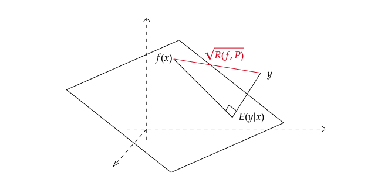

## A Useful Technique

Recall that the oracle predictor is given by

$$
E(y|x) = \int_{\mathcal{Y}} y\cdot p(y|x) \,\mathrm{d}y,
$$

which is a function of $x$, denoted as $f^*(x)$.

### Key Property

We will prove the following equation

$$
E_{(x,y)}\left(g(x)\cdot E(y|x)\right) = E_{(x,y)}\left(g(x)\cdot y\right),
$$

which holds for all functions $g$ where $Var\left(g(x)\right)<+\infty$(1). Specifically, when taking $g(x)\equiv 1$, we obtain the *law of total expectation,* i.e. $E\left(y\right) = E\left(E(y|x)\right)$(2).
{.annotate}

1. This a technical assumption which is usually satisfied in practical problems.
2. One special case states that if $\left\{A_i\right\}$ is a finite or countable partition of the sample space, then $E(X)=\sum_i E\left(X | A_i\right) \cdot Pr\left(A_i\right)$.

Obviously, it is equivalent to

$$
E_{(x,y)}\left(g(x)\left(y-E(y|x)\right)\right) = 0,
$$

which is an orthogonality property.

### Proof

$$
\begin{aligned}
E_(x,y)\left(g(x)\cdot E(y|x)\right) 
&= E_x\left(g(x)\cdot E(y|x)\right) \\
&= \int_{\mathcal{X}}g(x)\cdot E(y|x) p(x) \,\mathrm{d}x \\
&= \int_{\mathcal{X}}g(x)\cdot p(x) \int_{\mathcal{Y}} y\cdot p(y|x) \,\mathrm{d}y \,\mathrm{d}x \\
&= \int_{\mathcal{X}} \int_{\mathcal{Y}} g(x)\cdot y \cdot p(y|x) p(x) \,\mathrm{d}y \,\mathrm{d}x \\
&= E_{(x,y)}\left(g(x)\cdot y\right),
\end{aligned}
$$

where the last equation is from $p(y|x) p(x) = p(x,y)$.

### Reprove the Oracle Predictor

Let us show again that $E(y|x)$ is the oracle predictor under the squared error loss:

$$
\begin{aligned}
R(f,P) 
&= E_{(x,y)}\left(\left(f(x)-y\right)^2\right) \\
&= E_{(x,y)}\left(\left(f(x)-E(y|x)+E(y|x)-y\right)^2\right) \\
&= E_{(x,y)}\left(\left(f(x)-E(y|x)\right)^2\right) + 2E_{(x,y)}\left({\color{red} \left(f(x)-E(y|x)\right)}\left(E(y|x)-y\right)\right) \\ 
&\quad + E_{(x,y)}\left(\left(E(y|x)-y\right)^2\right) \\
&= {\color{green} E_{(x,y)}\left(\left(f(x)-E(y|x)\right)^2\right)} + {\color{blue} E_{(x,y)}\left(\left(E(y|x)-y\right)^2\right)},
\end{aligned}
$$

where the last equation is from the equivalent form of the key property regarding the above $\color{red}{\text{red}}$ term as a function of $x$.
Note that both the $\color{green}{\text{green}}$ and $\color{blue}{\text{blue}}$ term are non-negative, and the $\color{blue}{\text{blue}}$ term is independent of $f$. Therefore, to minimize $R(f,P)$, it is sufficient to minimize the $\color{green}{\text{green}}$ term, and the minimizer $f^*(x) = E(y|x)$.

### Geometric Illustration

Pythagorean Decomposition of $R(f,P)$: $E(y|x)$ can be viewed as an orthogonal projection of $y$ on the space of random variables that are functions of $x$. Precisely, consider the space of all r.v. with finite variance(1) and the set of all r.v. that are functions of $x$ becomes a hyperplane lying in this space. The Pythagorean decomposition of $R(f,P)$ is shown in the following figure. 
{.annotate}

1. This space is a $L^2$ space. 

